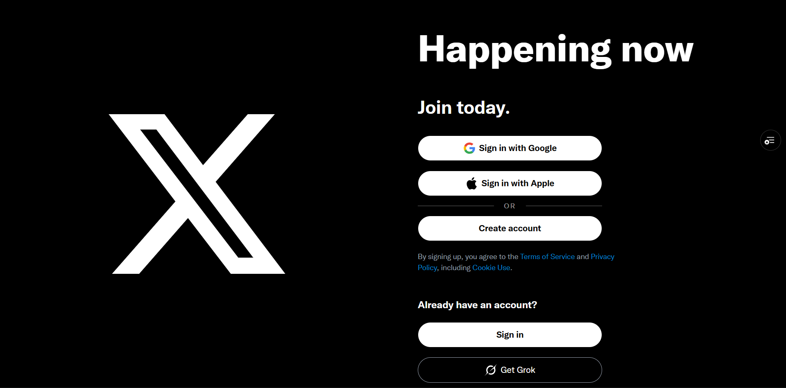

# X-Clone



A full-stack X.com clone focused on performance and modern architecture.

## Tech Stack

- **Framework**: Next.js 16 (App Router)
- **Language**: TypeScript
- **Styling**: Tailwind CSS 4
- **Database**: PostgreSQL via Neon
- **ORM**: Prisma
- **Data Fetching**: TanStack Query v5
- **Authentication**: Clerk
- **File Storage**: UploadThing
- **UI Components**: Radix UI

## Features

- Real-time post creation and interactions
- Dynamic theme and responsive layout
- Secure user authentication and profiles
- Type-safe media uploads (images and video)
- Optimistic UI updates with TanStack Query

## Getting Started

1. Install dependencies:
   ```bash
   pnpm install
   ```

2. Set up environment variables in .env:
   ```env
   DATABASE_URL=
   NEXT_PUBLIC_CLERK_PUBLISHABLE_KEY=
   CLERK_SECRET_KEY=
   UPLOADTHING_Token=
   ```

3. Sync database:
   ```bash
   npx prisma db push
   ```

4. Run locally:
   ```bash
   npm run dev
   ```
